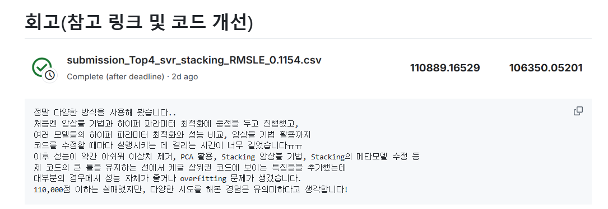
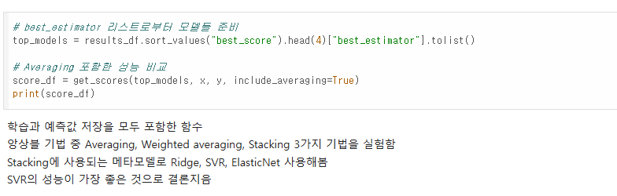
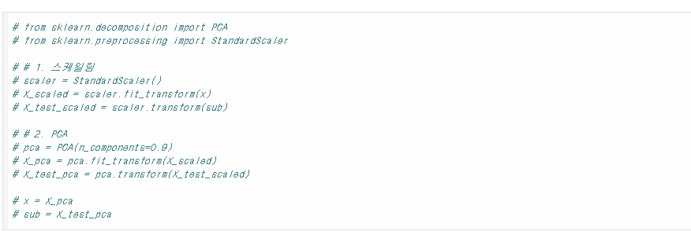

# AIFFEL Campus Online Code Peer Review Templete
- 코더 : 조성호
- 리뷰어 : 김현진


# PRT(Peer Review Template)
- []  **1. 주어진 문제를 해결하는 완성된 코드가 제출되었나요?**
    - 문제에서 요구하는 최종 결과물이 첨부되었는지 확인
        - 중요! 해당 조건을 만족하는 부분을 캡쳐해 근거로 첨부
        

    
- [x]  **2. 전체 코드에서 가장 핵심적이거나 가장 복잡하고 이해하기 어려운 부분에 작성된 
주석 또는 doc string을 보고 해당 코드가 잘 이해되었나요?**
    - 해당 코드 블럭을 왜 핵심적이라고 생각하는지 확인
    - 해당 코드 블럭에 doc string/annotation이 달려 있는지 확인
    - 해당 코드의 기능, 존재 이유, 작동 원리 등을 기술했는지 확인
    - 주석을 보고 코드 이해가 잘 되었는지 확인
        - 중요! 잘 작성되었다고 생각되는 부분을 캡쳐해 근거로 첨부
        
        
- [x]  **3. 에러가 난 부분을 디버깅하여 문제를 해결한 기록을 남겼거나
새로운 시도 또는 추가 실험을 수행해봤나요?**
    - 문제 원인 및 해결 과정을 잘 기록하였는지 확인
    - 프로젝트 평가 기준에 더해 추가적으로 수행한 나만의 시도, 
    실험이 기록되어 있는지 확인
        - 중요! 잘 작성되었다고 생각되는 부분을 캡쳐해 근거로 첨부
        
        
- [x]  **4. 회고를 잘 작성했나요?**
    - 주어진 문제를 해결하는 완성된 코드 내지 프로젝트 결과물에 대해
    배운점과 아쉬운점, 느낀점 등이 기록되어 있는지 확인
    - 전체 코드 실행 플로우를 그래프로 그려서 이해를 돕고 있는지 확인
        - 중요! 잘 작성되었다고 생각되는 부분을 캡쳐해 근거로 첨부
        

        
- [ ]  **5. 코드가 간결하고 효율적인가요?**
    - 파이썬 스타일 가이드 (PEP8) 를 준수하였는지 확인
    - 코드 중복을 최소화하고 범용적으로 사용할 수 있도록 함수화/모듈화했는지 확인
        - 중요! 잘 작성되었다고 생각되는 부분을 캡쳐해 근거로 첨부


# 회고(참고 링크 및 코드 개선)

```
정말 다양한 방식을 사용해 봤습니다..
처음엔 앙상블 기법과 하이퍼 파라미터 최적화에 중점을 두고 진행했고,
여러 모델들의 하이퍼 파라미터 최적화와 성능 비교, 앙상블 기법 활용까지
코드를 수정할 때마다 실행시키는 데 걸리는 시간이 너무 길었습니다ㅠㅠ
이후 성능이 약간 아쉬워 이상치 제거, PCA 활용, Stacking 앙상블 기법, Stacking의 메타모델 수정 등
제 코드의 큰 틀을 유지하는 선에서 케글 상위권 코드에 보이는 특징들을 추가했는데
대부분의 경우에서 성능 자체가 줄거나 overfitting 문제가 생겼습니다.
110,000점 이하는 실패했지만, 다양한 시도를 해본 경험은 유의미하다고 생각합니다!
```
~~그래야만 합니다ㅠㅠ~~
