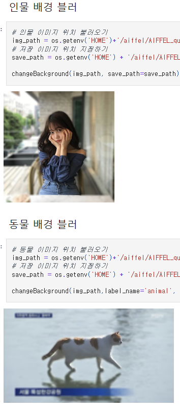
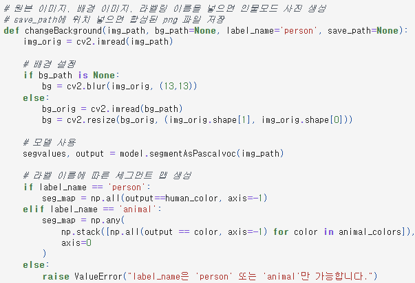
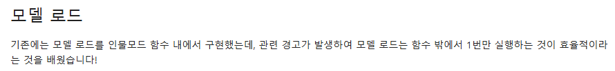
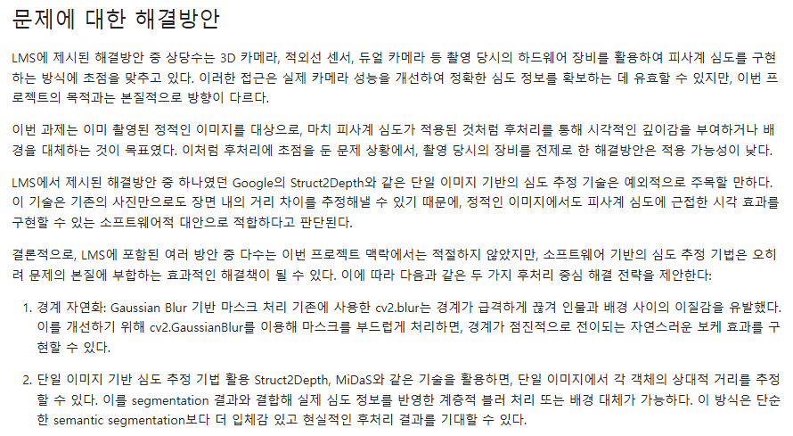
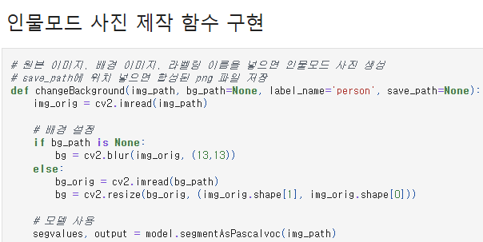

# AIFFEL Campus Online Code Peer Review Templete
- 코더 : 조성호
- 리뷰어 : 오가현


# PRT(Peer Review Template)
- [O]  **1. 주어진 문제를 해결하는 완성된 코드가 제출되었나요?**
    - 문제에서 요구하는 최종 결과물이 첨부되었는지 확인
        - 중요! 해당 조건을 만족하는 부분을 캡쳐해 근거로 첨부</br>
        </br>
        - 인물과 동물 각 사진의 배경을 블러 처리해보는 과제를 잘 수행하였다.
        - 추가로 배경을 변경하는 작업까지 시도한 게 좋았다.
        

    
- [O]  **2. 전체 코드에서 가장 핵심적이거나 가장 복잡하고 이해하기 어려운 부분에 작성된 
주석 또는 doc string을 보고 해당 코드가 잘 이해되었나요?**
    - 해당 코드 블럭을 왜 핵심적이라고 생각하는지 확인
    - 해당 코드 블럭에 doc string/annotation이 달려 있는지 확인
    - 해당 코드의 기능, 존재 이유, 작동 원리 등을 기술했는지 확인
    - 주석을 보고 코드 이해가 잘 되었는지 확인
        - 중요! 잘 작성되었다고 생각되는 부분을 캡쳐해 근거로 첨부</br>
        </br>
        - 전체적으로 각 코드가 어떤 작업을 위한 코드인지에 대해 주석이 잘 달려있었다.
        
- [O]  **3. 에러가 난 부분을 디버깅하여 문제를 해결한 기록을 남겼거나
새로운 시도 또는 추가 실험을 수행해봤나요?**
    - 문제 원인 및 해결 과정을 잘 기록하였는지 확인
    - 프로젝트 평가 기준에 더해 추가적으로 수행한 나만의 시도, 
    실험이 기록되어 있는지 확인
        - 중요! 잘 작성되었다고 생각되는 부분을 캡쳐해 근거로 첨부
        </br>
        - 모델 로드를 함수 안에 구현했을 때의 문제점을 확인한 후 이를 해결하는 과정까지 도출하였다.
        
- [O]  **4. 회고를 잘 작성했나요?**
    - 주어진 문제를 해결하는 완성된 코드 내지 프로젝트 결과물에 대해
    배운점과 아쉬운점, 느낀점 등이 기록되어 있는지 확인
    - 전체 코드 실행 플로우를 그래프로 그려서 이해를 돕고 있는지 확인
        - 중요! 잘 작성되었다고 생각되는 부분을 캡쳐해 근거로 첨부
        </br>
        - 주어진 문제를 해결할 때 아쉬운 점과 이를 해결하기 위한 해결방안을 잘 작성해주었다.
        
- [O]  **5. 코드가 간결하고 효율적인가요?**
    - 파이썬 스타일 가이드 (PEP8) 를 준수하였는지 확인
    - 코드 중복을 최소화하고 범용적으로 사용할 수 있도록 함수화/모듈화했는지 확인
        - 중요! 잘 작성되었다고 생각되는 부분을 캡쳐해 근거로 첨부
      </br>
      - 함수를 적절하게 사용하여 코드를 간결하고 효율적으로 사용할 수 있었다.


# 회고(참고 링크 및 코드 개선)
```
# 리뷰어의 회고를 작성합니다.
# 코드 리뷰 시 참고한 링크가 있다면 링크와 간략한 설명을 첨부합니다.
# 코드 리뷰를 통해 개선한 코드가 있다면 코드와 간략한 설명을 첨부합니다.
```
같은 작업을 수행하는 것이다 보니 비슷한 코드임에도 불구하고 조금 더 효율적인 코드를 위해 고민한 흔적이 보였다.   
또한 나는 모델을 함수 안에 넣으면 효율이 떨어지는 걸 모른 채로 밖에 꺼냈었는데 이러한 이슈를 배울 수 있어서 좋았다.   
설명도 너무 자세하게 해주셔서 복습하는 것처럼 다시 한 번 리마인드 할 수 있었다! :)
