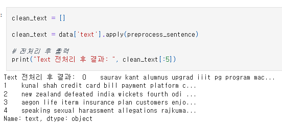
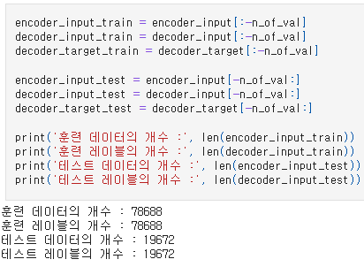
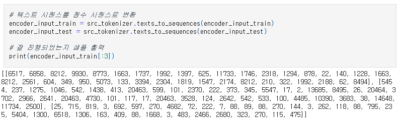
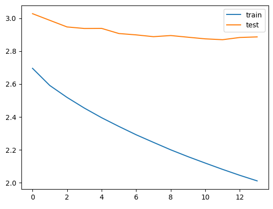
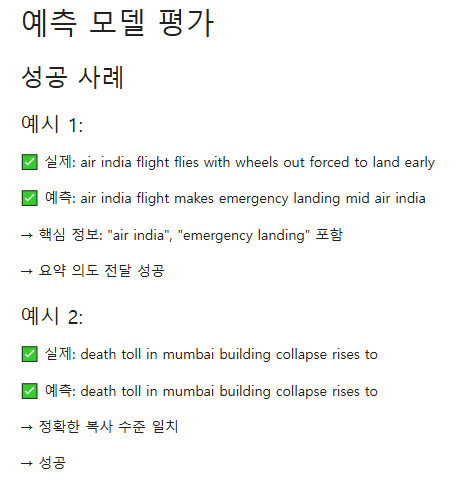
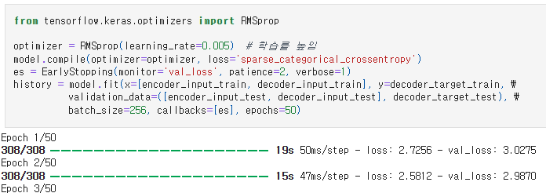

# AIFFEL Campus Online Code Peer Review Templete
- 코더 : 조성호
- 리뷰어 : 김성훈


# PRT(Peer Review Template)
- [x]  **1. 주어진 문제를 해결하는 완성된 코드가 제출되었나요?**
  
    - 
    - 전처리
    - 
    - 데이터셋 분리
    - 
    - 인코딩
    - 
    - Loss 그래프
    - 
    - 핵심 단어가 포함된 요약 문장. 성공적인 학습 결과.
    
    
- [x]  **2. 전체 코드에서 가장 핵심적이거나 가장 복잡하고 이해하기 어려운 부분에 작성된 
주석 또는 doc string을 보고 해당 코드가 잘 이해되었나요?**
  
    - 
    - 기존 학습에서 Under fitting된 부분을 learning rate를 조절하여 해결한 부분이 가장 핵심.
    - 코드의 의도가 잘 들어나도록 주석을 달거나 출력물의 내용이 뭔지 함께 적어두어 어려운 부분 없이 가독성 좋은 코드.
    
        
- [x]  **3. 에러가 난 부분을 디버깅하여 문제를 해결한 기록을 남겼거나
새로운 시도 또는 추가 실험을 수행해봤나요?**
    
    - 2번 문항에서 언급한 것과 같이 Under fitting 문제가 있었고 학습률 조정으로 이를 해결하였다.
    - 평가 기준과 별개로 학습 성능을 높이기 위한 이러한 시도로 굉장히 낮은 Loss값을 얻은 것 같다.

        
- [x]  **4. 회고를 잘 작성했나요?**
  
    - 프로젝트를 진행하면 알게된 점과 느낀점을 간략히 작성해두었다.
    
        
- [x]  **5. 코드가 간결하고 효율적인가요?**
    
    - 2번 문항에서 언급한 바와 같이 코드의 의도가 잘 들어나도록 주석을 달거나 출력물의 내용이 뭔지 함께 적어두어 어려운 부분 없이 가독성 좋은 코드였다.


# 회고(참고 링크 및 코드 개선)
```
- 데이터 길이에 대한 분포를 보고 과감하게 전체 길이로 진행해본 점을 흥미로웠습니다. 저도 한 번 해봐도 될 것 같다는 생각만 하고 시간 관계상 지나친 부분을 직접 확인할 수 있어서 좋았습니다.

- Loss값이 상당히 낮게 나온 점, 이를 얻을 수 있었던 비결이 무엇인지를 알게되어 좋은 공부가 되었습니다.
```
