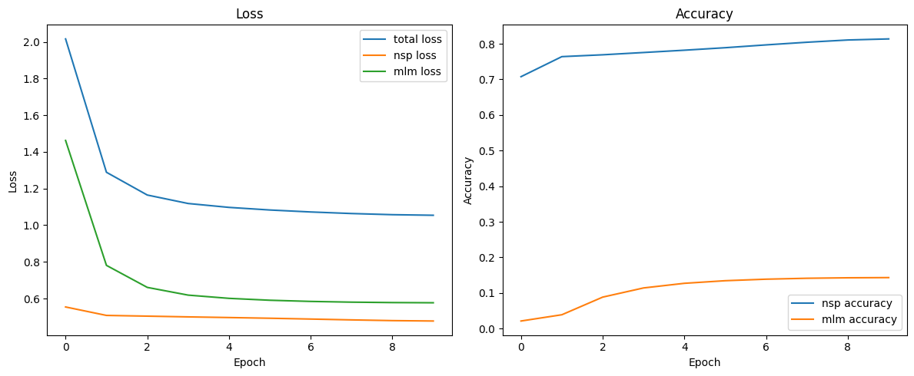
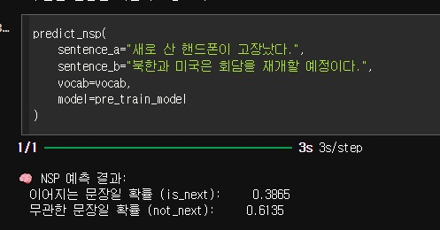
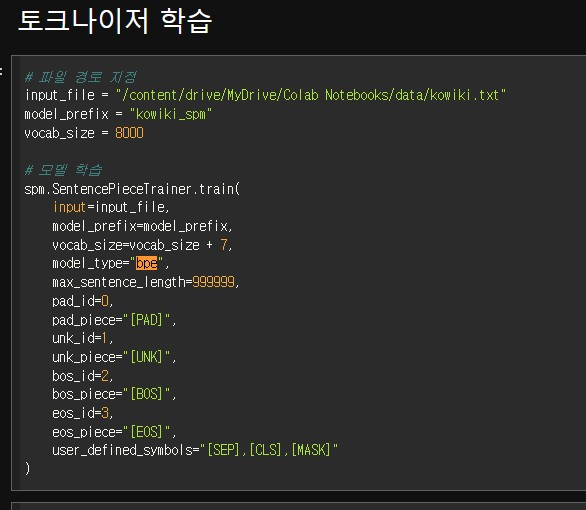
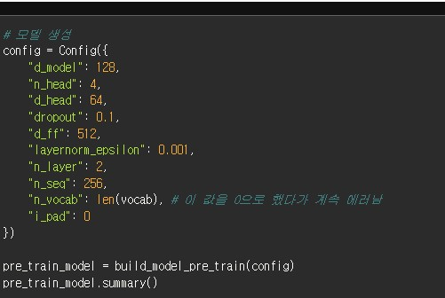
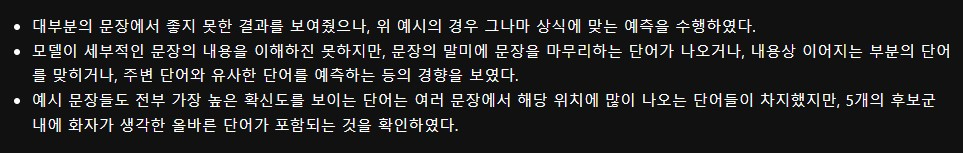
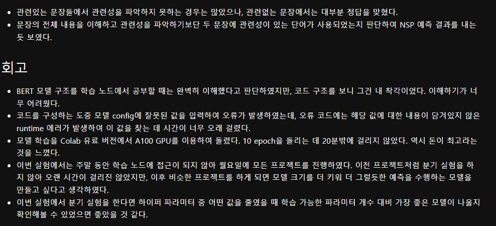

# AIFFEL Campus Online Code Peer Review Templete
- 코더 : 조성호
- 리뷰어 : 김범모

# PRT(Peer Review Template)
- [X]  **1. 주어진 문제를 해결하는 완성된 코드가 제출되었나요?**

        - nsp, mlm 성공적으로 학습이 진행되었고 loss도 감소하였습니다.
        - 학습된 모델의 추론 결과를 확인했습니다.

    
- [X]  **2. 전체 코드에서 가장 핵심적이거나 가장 복잡하고 이해하기 어려운 부분에 작성된 
주석 또는 doc string을 보고 해당 코드가 잘 이해되었나요?**

        - 한글은 unigram보다 bpe가 더 성능이 좋다는 것을 적용하여 sentencepiece를 bpe로 설정하였습니다.

- [X]  **3. 에러가 난 부분을 디버깅하여 문제를 해결한 기록을 남겼거나
새로운 시도 또는 추가 실험을 수행해봤나요?**

         - 모델의 파라미터를 변경하여 일반화를 진행하고자 하였습니다.
         
- [X]  **4. 회고를 잘 작성했나요?**

        
- [X]  **5. 코드가 간결하고 효율적인가요?**

        - 네, 전체적으로 코드가 간결하고 효율적이었습니다.

# 회고(참고 링크 및 코드 개선)
